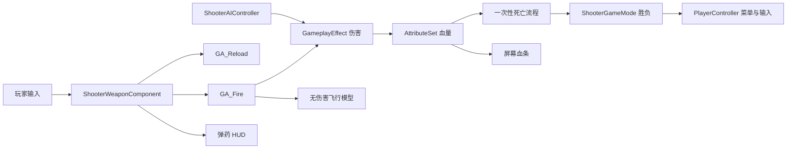

# MyShoot / Shooter

UE5.5 单机 FPS 学习项目：将现有 Blueprint 原型逐步迁移为 UE C++ + Blueprint，使用 GAS 管理伤害、生命值、射击、换弹与死亡。

本项目保留旧蓝图节点作为学习对照。模型、动画、音效、特效及可编辑 UMG 继续由蓝图配置。

## 环境与启动

- Windows 64 位。
- Unreal Engine 5.5。
- Visual Studio 2022，安装 UE C++ 开发所需工作负载和 Windows SDK。
- 不需要安装 Visual Studio 2015。
- 源码基线：develop 分支。T07 功能提交为 `43be8d0`；T08 打包相关改动见当前工作树或后续提交记录。

编辑器运行：

1. 用 UE5.5 打开 `MyShoot.uproject`。
2. 首次打开或 C++ 反射结构更新后，关闭编辑器并完成 Development Editor / Win64 构建。
3. 打开 `/Game/Maps/bloodstrike`，GameMode Override 应为 `Mygame_GM`。
4. PIE 后在开始菜单点击 START GAME。

Windows 打包基线运行：

- 打包输出目录：`PackagedBuilds/T08/Windows`。
- 启动该目录下的 `MyShoot.exe`。
- 移动、复制或交付时保留整个 Windows 文件夹；单独复制 exe 不包含地图和资源。
- Windows Development 打包已完成，实际包自动回归与连续三次重开通过。包体约 1.01 GiB；详细结果和验证边界见 [T08 记录](Docs/T08_PACKAGING_BASELINE.md)。

## 操作

| 输入 / 按钮 | 行为 |
| --- | --- |
| W / A / S / D | 移动 |
| 鼠标 | 视角 |
| 空格 | 跳跃 |
| 鼠标左键 | 射击 / 持续射击 |
| R | 换弹 |
| P | 开关暂停菜单，PIE 优先使用 |
| Esc | 独立运行中也可开关暂停；编辑器可能用它结束 PIE |
| START GAME | 开始或继续 |
| END GAME | 暂停时结束本局，返回开始菜单 |
| RESTART | 胜利/失败后重载关卡并开始 |
| MAIN MENU | 结算后返回开始菜单 |
| QUIT GAME | 退出游戏 |

## 已实现的玩法

- 公共 GAS 角色、Health / MaxHealth、GameplayEffect 伤害及一次性死亡流程。
- 单武器组件与 GA_Fire：默认每发 25 伤害、弹匣 30 发；跨按键保留射速限制。
- GA_Reload：默认备用弹药 90 发、换弹 1.5 秒；完成时转移弹药，取消和死亡不延迟补弹。
- AI 发现、NavMesh 追踪、距离和视线检查、近距离 GAS 攻击；默认 10 伤害、0.3 秒前摇、1.25 秒间隔。
- GAS 事件驱动的屏幕血条；武器事件驱动的弹匣、备用弹药和换弹提示。
- 原图开始菜单、暂停、胜利/失败、重开；同一帧玩家和最后一个敌人死亡时失败优先。
- 从枪口飞向射线端点的可见弹头，纯表现、无碰撞，不改变原射线结算时机。
- 保留原动画、音效、特效、准星及用于对照的旧蓝图节点。

## 职责与目录



- `Source/MyShoot/Public`：头文件。
- `Source/MyShoot/Private`：实现与测试。
- `Characters`：角色、ASC 初始化、死亡生命周期。
- `GAS`：属性、效果、射击与换弹能力。
- `Weapons`：武器状态和子弹表现。
- `AI`：追踪与攻击。
- `Game`：对局规则与关卡重载。
- `Player / UI`：屏幕界面、数据订阅和输入模式。
- `Plugins/ShooterEditorTools`：仅编辑器使用的蓝图接入与检查工具，不进入游戏运行时模块。
- `SourceArt/UI`：项目 UI 原图与导入源文件。

## 构建、验证与打包

以下 PowerShell 示例中的引擎目录可替换为自己的 UE5.5 安装位置；在项目目录执行。

```powershell
& 'D:/UE_Engine/UE_5.5/Engine/Build/BatchFiles/Build.bat' MyShootEditor Win64 Development "-Project=$((Get-Location).Path)/MyShoot.uproject" -WaitMutex -NoHotReloadFromIDE
```

在编辑器 Automation 窗口运行 `MyShoot.GAS.` 测试组。当前测试覆盖基础属性、伤害、死亡、射击、换弹、AI、血条、对局及弹药/子弹表现。

```powershell
& 'D:/UE_Engine/UE_5.5/Engine/Build/BatchFiles/RunUAT.bat' BuildCookRun "-project=$((Get-Location).Path)/MyShoot.uproject" -noP4 -platform=Win64 -clientconfig=Development -build -cook -map=/Game/Maps/bloodstrike -stage -pak -iostore -archive "-archivedirectory=$((Get-Location).Path)/PackagedBuilds/T08" -prereqs -utf8output -unattended -nocompileeditor
```

Development 包可以显式传入 `-ShooterSmoke`，在真实关卡中自动检查玩法与三次重开。该模式会自动操作角色和退出程序；普通运行不传此参数。验证输出默认在运行程序的 Saved/T08Smoke，可通过 `-ShooterSmokeOutput="绝对输出目录"` 指定。Shipping 不启用此入口。

## 当前边界与后续优化

- 当前是单机项目，尚未实现多人复制与客户端预测。
- AI 当前是近距离定时攻击，没有专用攻击动画，也不是独立的 AI 枪械射击系统。
- 子弹模型只做表现。镜头射线与枪口在贴墙时可能不同，表现路径裁剪不会改变伤害射线。
- 击杀名单不包含刷怪波次/敌人撤退规则；直接 Destroy 活敌人不会算作击杀。
- 原有两个 AnimBP 的 6 条线程安全编译警告仍待优化。
- 开始菜单按钮文字在原图中，暂停时 START GAME 通过提示说明为继续。
- 打包基线完成后可继续优化射击反馈、AI 攻击表现、菜单/HUD 和性能；首次打包不是最终定版。

## 工作记录

- [总工作计划](Docs/UE5_GAS_WORK_PLAN.md)
- [T05 换弹](Docs/T05_GAS_RELOAD.md)
- [T06 AI 与血条](Docs/T06_AI_AND_PLAYER_HEALTH_UI.md)
- [T07 菜单、胜负、弹药与子弹](Docs/T07_ROUND_MENU_AND_BULLETS.md)
- [T08 打包基线](Docs/T08_PACKAGING_BASELINE.md)
- [C++ 文件和中文注释规范](Docs/CPP_CODE_CONVENTIONS.md)

Git 保留代码、配置和运行必需资源，忽略 Binaries、Intermediate、Saved、DerivedDataCache、IDE 缓存和 PackagedBuilds。个人学习笔记不自动纳入功能提交。
