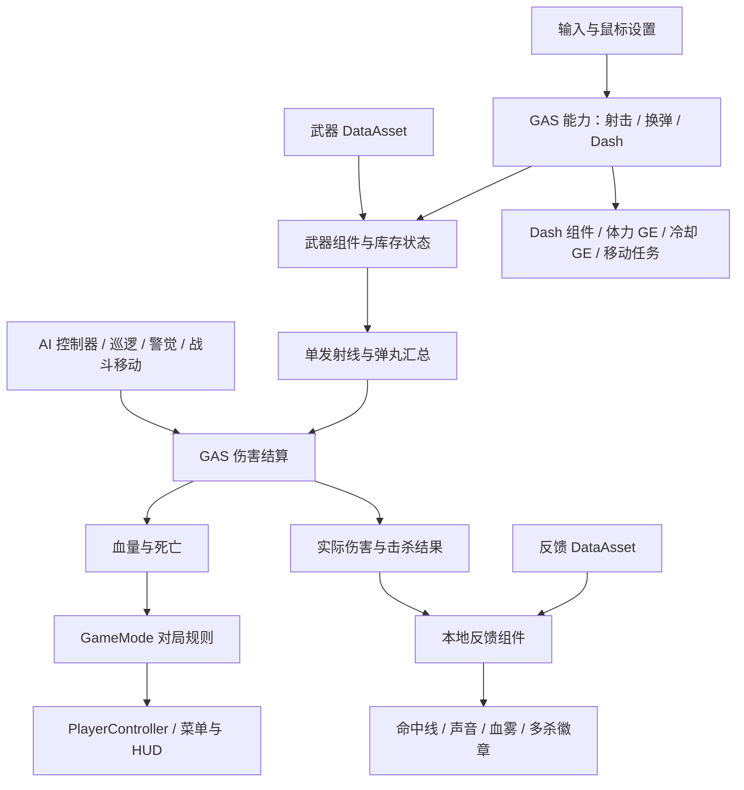

# Shooter · UE5 GAS FPS Demo

基于 **Unreal Engine 5.5、UE C++、Blueprint 与 Gameplay Ability System（GAS）** 的单机第一人称射击项目。由早期 UE4 蓝图原型逐步重构，包含双武器战斗、AI 巡逻与警觉、拾取、地面／空中闪避、完整对局流程及命中反馈。

项目重点是 Gameplay 规则、组件职责、能力生命周期和中断清理。C++ 管理规则与状态，Blueprint 配置模型、动画、资源和部分表现；保留断开的旧蓝图节点供学习对照。当前功能已逐阶段体验验收，最新独立包的验证状态见 [最终交付记录](Docs/T21_FINAL_DELIVERY.md)。

## 运行与操作

源码分支：**[develop](https://github.com/xx10180827/Shooter/tree/develop)**。本仓库不包含编译缓存、游戏安装包或引擎。

- 源码环境：Windows x64、UE **5.5.4**、Visual Studio 2022 的 C++ 游戏开发工具和 Windows SDK。本机验证工具链为 MSVC 14.38 / Windows SDK 10.0.22621.0，无须 VS2015。
- 使用 UE5.5 打开 MyShoot.uproject；首次运行先编译 MyShootEditor / Win64 / Development。
- 打开 /Game/Maps/bloodstrike，PIE 后点击 **START GAME**。地图使用 Mygame_GM。
- 独立包入口为 Windows/MyShoot.exe。复制给其他电脑时必须携带整个 Windows 文件夹，不能只复制 exe。运行独立包无须安装 UE 编辑器。
- 本轮本地验收包约定目录：PackagedBuilds/T21_20261007/Windows。它是本地输出路径，**不是 GitHub 下载链接**；构建和验收结果见交付记录。

| 操作 | 功能 |
| --- | --- |
| W / A / S / D、鼠标、空格 | 移动、视角、跳跃 |
| 左键 | 射击；步枪可按住连射 |
| 右键 | 切换瞄准，再按退出；瞄准使用小红点 |
| R | 换弹 |
| 1 / 2 | 切换已经持有的步枪／霰弹枪 |
| F | 拾取准星指向的近处物品 |
| Shift | 单次闪避；有移动输入沿输入方向，无输入向前 |
| P | 暂停／继续，适合 PIE |
| Esc | 独立包中暂停；PIE 可能被编辑器用于停止运行 |
| SETTINGS | 开始／暂停菜单中的鼠标设置 |
| RESTART / MAIN MENU / QUIT GAME | 重开／返回菜单／退出 |

## 已实现内容

| 系统 | 行为与技术要点 |
| --- | --- |
| GAS 战斗基础 | ASC、Health / MaxHealth、GameplayEffect 伤害、死亡状态与一次性死亡流程；事件驱动血条更新 |
| 双武器 | 玩家初始持步枪，拾取后获得霰弹枪；DataAsset 配置与每把武器的运行时弹药分离 |
| 射击与换弹 | GA_Fire / GA_Reload 接入；射速限制、空弹匣阻止射击；换弹、切枪、死亡的取消与清理 |
| 武器表现 | 腰射／瞄准、真实视角后坐力与鼠标压枪、手臂动作、枪声、可见飞行弹头 |
| 霰弹枪 | 多弹丸散布、按目标汇总 GAS 伤害；一枪只扣一发弹并合并反馈 |
| AI | NavMesh 寻路、自主巡逻与返回巡逻、视野／距离／遮挡判定、听觉与受击警觉、搜索及移动射击；攻击动画、枪声与弹头 |
| 拾取 | 触发区域筛选、准星选择与遮挡检查；成功领取才消耗，防止重复领取；金色地面光圈 |
| 弹药补给 | 对应武器弹匣和备弹补满：步枪 **30 / 90**，霰弹枪 **8 / 32**；两项都满时保留物品 |
| Dash | GAS 体力消耗、恢复、冷却与状态互斥；地面／空中约 **480 cm / 0.22 s**；空中期间保持高度，结束恢复下落；活动窗口内无敌，保留碰撞 |
| HUD 与菜单 | 屏幕血条、弹药、体力与冷却、拾取提示；开始、暂停、胜负、重开和返回菜单 |
| 鼠标设置 | 腰射默认 **0.80**、ADS 倍率 **0.75**，立即生效、恢复默认、跨启动保存；与武器后坐力分离 |
| 打击反馈 | 实际扣血才出现四条短线和清脆确认音；击杀变金色，播放击杀音及徽章；3 秒窗口多杀倍数；限量短促血雾 |

换弹中切枪会取消旧换弹；Dash 期间禁止开火、换弹和切枪，换弹期间不能发动 Dash。暂停、死亡和重开均包含状态与表现清理。

## 架构与代码入口



头文件位于 Source/MyShoot/Public，实现与测试位于 Source/MyShoot/Private，关键职责配有中文注释。

| 目录 | 职责 |
| --- | --- |
| Characters、GAS | 角色初始化、属性、GameplayEffect、能力与死亡 |
| Weapons | 武器配置、库存状态、射击、后坐力、瞄准与子弹表现 |
| AI | 感知响应、寻路、巡逻、搜索与交战 |
| Movement、Pickups | Dash 参数与移动配合、拾取事务及表现 |
| Combat | 统一伤害入口、详细结果、反馈配置与本地表现调度 |
| Game、Player、UI、Settings | 对局、输入、HUD、菜单及设置保存 |
| Private/Tests | 自动化测试及显式启动的真实地图检查 |
| Plugins/ShooterEditorTools | 随仓库提供的编辑器工具模块，不作为游戏运行时模块 |
| SourceArt | UI、音频等制作和导入源文件；游戏运行使用 Content 资源 |

适合阅读的三个流程：换弹中切枪的取消、霰弹枪多弹丸结算与反馈合并、地空 Dash 的结束与中断清理。对应记录见下方文档索引。

## 构建、测试与打包

在仓库根目录执行 PowerShell，将引擎路径替换为本机安装位置。

```powershell
$ueRoot = 'D:/UE_Engine/UE_5.5'
$projectFile = Join-Path (Get-Location).Path 'MyShoot.uproject'

& "$ueRoot/Engine/Build/BatchFiles/Build.bat" MyShootEditor Win64 Development "-Project=$projectFile" -WaitMutex -NoHotReloadFromIDE

& "$ueRoot/Engine/Binaries/Win64/UnrealEditor-Cmd.exe" $projectFile -unattended -NullRHI '-ExecCmds=Automation RunTests MyShoot.' '-TestExit=Automation Test Queue Empty'

$packageDirectory = Join-Path (Get-Location).Path 'PackagedBuilds/T21_20261007'
& "$ueRoot/Engine/Build/BatchFiles/RunUAT.bat" BuildCookRun "-project=$projectFile" -noP4 -platform=Win64 -clientconfig=Development -build -cook -map=/Game/Maps/bloodstrike -stage -pak -iostore -archive "-archivedirectory=$packageDirectory" -prereqs -utf8output -unattended -nocompileeditor
```

检查每条命令的退出码，前一步失败时先修复再继续。-nocompileeditor 以首步已经成功构建编辑器目标为前提。

自动测试覆盖 GAS、能力取消、换弹／切枪、拾取、Dash 碰撞与无敌、灵敏度与后坐力、反馈去重与多杀。测试记录明确区分自动结果和人工音效／手感验收。

Development 游戏包支持以下**仅用于测试**的启动参数，正常游玩不要添加。它们会自动操作游戏并退出，不是玩家功能，Shipping 不启用这些检查入口。

| 参数 | 检查范围 |
| --- | --- |
| -ShooterSmoke | 对局流程、AI 伤害、射击、换弹、菜单和多次重开 |
| -ShooterPickupSmoke | 拾取、补满弹药与光圈 |
| -ShooterDashSmoke | 地面／空中闪避、无敌及清理 |
| -ShooterMouseSettingsSmoke | 菜单设置和保存；第二个进程追加 -ShooterMouseSettingsVerify 验证读取 |
| -ShooterCombatFeedbackSmoke | 真实伤害反馈、点射／连射音频进度、多杀与暂停清理 |

具体参数与结果以 [最终交付记录](Docs/T21_FINAL_DELIVERY.md) 为准；实际运行检查不能代替另一台电脑上的兼容性验收。

## 当前边界

- **单机 Gameplay Demo**，没有实现多人复制、服务器对战或客户端预测。
- 可见弹头用于表现，伤害由射线结算；镜头射线与枪口贴墙遮挡尚未统一为二次伤害检测。
- AI 以 C++ 组件、定时决策和引擎感知组织，未宣称使用 Behavior Tree / Blackboard。
- 霰弹枪使用现有动画资源调整表现；换弹按完整过程结束补弹，不宣称具有完整逐颗装填与专用骨骼动画。
- 血雾使用 Cascade CPU Sprite 粒子，尚未迁移 Niagara。没有正式性能基准或多人压力测试结论。
- 模型、动画和部分 UI 复用／改造现有资源，不宣称全部为原创；代码、资源配置与验证过程结合 AI 辅助迭代，作者参与需求设计、编辑器配置与体验验收。
- 保留早期蓝图和历史记录供对照；历史文档中的参数、待验收状态不代表当前版本，以最新对应阶段记录为准。

## 文档索引

- [总工作记录](Docs/UE5_GAS_WORK_PLAN.md) · [C++ 目录与注释规范](Docs/CPP_CODE_CONVENTIONS.md)
- [GAS 射击](Docs/T04_GAS_FIRE.md) · [换弹与中断](Docs/T05_GAS_RELOAD.md)
- [AI 视野交战](Docs/T11_AI_SIGHT_AND_RANGED_COMBAT.md) · [巡逻](Docs/T12_AI_PATROL.md) · [警觉与移动射击](Docs/T13_AI_AWARENESS_AND_MOVING_FIRE.md)
- [武器数据与切换](Docs/T14_WEAPON_DATA_AND_SWITCHING.md) · [霰弹枪表现](Docs/T14_SHOTGUN_PRESENTATION.md) · [步枪后坐力](Docs/T14_RIFLE_RECOIL.md)
- [拾取与光圈](Docs/T15_PICKUPS.md) · [GAS Dash](Docs/T16_GAS_DASH.md) · [空中 Dash 与无敌](Docs/T17_AIR_DASH_INVULNERABILITY.md)
- [鼠标设置](Docs/T19_MOUSE_SETTINGS.md) · [打击感反馈](Docs/T20_COMBAT_FEEDBACK.md)
- [T21 最终交付与验收](Docs/T21_FINAL_DELIVERY.md)

Git 保留代码、配置及必需资源；忽略 Binaries、Intermediate、Saved、DerivedDataCache、IDE 个人设置和 PackagedBuilds。游戏包单独交付，避免将可再生成的大文件推入源码仓库。
